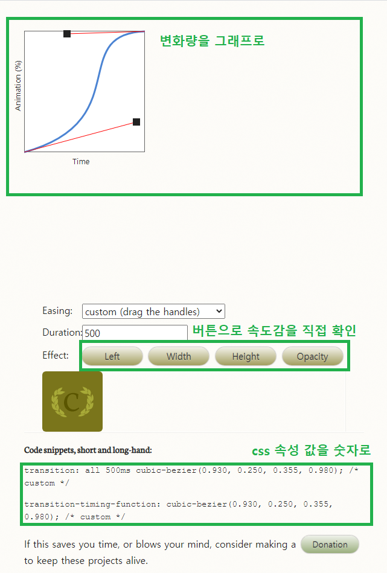

2\. 랜덤2_회전
-
```js
//최대 720도 (2바퀴) 까지 회전을 할 수 있도록
rotateNum = Math.round(Math.random()*720);
```
---
```css
transition: 이벤트(transform, scale, skew ...) 시간(s) 움직이는방법(ease, ease-in-out, cubic-bezier(n,n,n,n) ...)
```
##### 여기서 cubic-bezier 저는 구간마다 움직임을 섬세하게 조절할 수 있음  
##### 해당 움직임은 아래 사이트에서 그 값을 눈으로 보고 구해올 수 있음
[cubic-bezier 값 구하는 사이트](https://matthewlein.com/tools/ceaser, "cubic-bezier 값 구하는 사이트")
##### 구글에 "css3 ease"를 검색하는 것으로 구할 수 있다.
##### 내용 설명은 아래와 같다.
---
