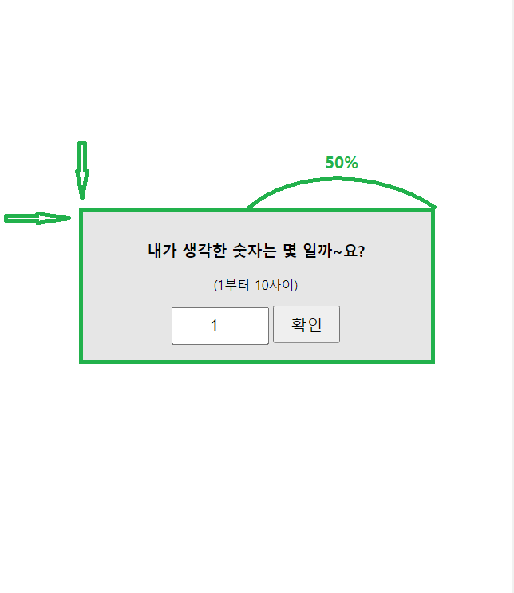
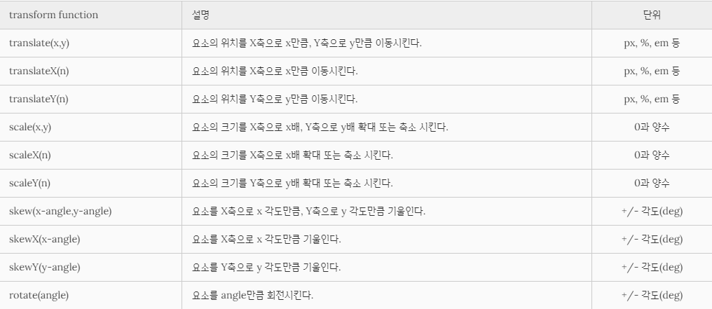

3\. 랜덤 업다운 게임
-
```css
// 컨테이너로 부터 일정 부분 떨어지기 위함 => 가운데 정렬
position: relative;
top: 40%;
left: 50%;
// 요소의 크기의 50% 만큼 x 축 y 축을 이동함 
transform: translate(-50%, -50%);
```
---
##[**실행결과**]

---
```css
//속성으로 요소에 회전, 크기 조절, 기울이기, 이동 효과를 부여할 수 있습니다
transform
```

---