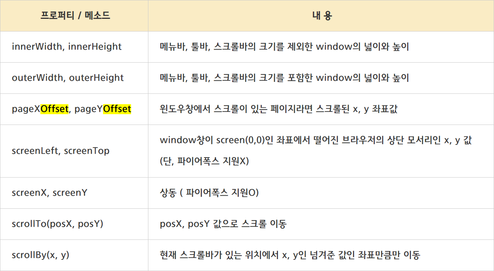

위치와 관련된 js 속성들
-



참고링크
-
* [Window 객체의 위치 프로퍼티와 메소드](https://webclub.tistory.com/105 "Window 객체의 위치 프로퍼티와 메소드")
* [절대위치 상대위치란?](https://mommoo.tistory.com/85 "절대위치 상대위치란?")


브라우저가 스크롤되는 시점 구하기
-
브라우저의 특정 위치가 section 영역을 기준으로 section 영역 안에 들어왔는지 검사하기 

```js
window.addEventListener("scroll", function(event) {
    // 전역 실행컨택스트 객체인 window 객체에서 값을 꺼내옴
    let scroll = this.scrollY;

    let sectionTop = section.offsetTop;
    let sectionHeight = section.offsetHeight;
    let windowCenter = window.outerHeight / 2;

    if ( (scroll > sectionTop - windowCenter) && scroll < (sectionTop + sectionHeight - windowCenter) ) {
        ...
    }
}
```
* this.scrollY : Window 인터페이스의 scrollY 읽기 전용 속성은 문서가 수직으로 얼마나 스크롤됐는지 픽셀 단위로 반환
* section.offsetTop : 섹션 탑의 위치 (부모요소 기준)
* section.offsetHeight : 섹션의 높이
* window.outerHeight: 메뉴바, 툴바, 스크롤 바를 포함한 윈도우 창의 높이